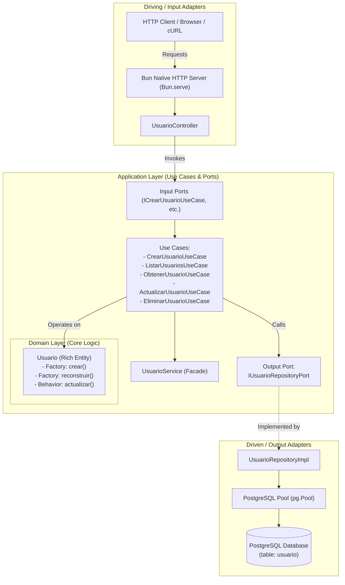

# 🚀 User Management Microservice

[](https://bun.com)
[](https://www.typescriptlang.org/)
[](https://www.postgresql.org/)
[](https://www.docker.com/)
[-orange)](#-architecture--design)

A high-performance RESTful User Management microservice built with **Bun**, **TypeScript**, and **PostgreSQL**, designed around **Hexagonal Architecture (Ports and Adapters)** and **Domain-Driven Design (DDD)** principles.

---

## 📋 Table of Contents

- [🎯 Objective](#-objective)
- [✨ Features](#-features)
- [🛠️ Tech Stack & Tools](#️-tech-stack--tools)
- [🏛️ Architecture & Design](#️-architecture--design)
- [📂 Directory Structure](#-directory-structure)
- [⚙️ Environment Variables](#️-environment-variables)
- [🗄️ Database Setup & Schema](#️-database-setup--schema)
- [⚡ Getting Started & Commands](#-getting-started--commands)
- [📖 API Reference & Usage Examples](#-api-reference--usage-examples)
- [🧪 Testing & Debugging](#-testing--debugging)
- [🐳 Docker & Production Deployment](#-docker--production-deployment)

---

## 🎯 Objective

The primary objective of this project is to implement a robust, maintainable, and high-performance microservice for managing users, demonstrating:

1. **Hexagonal Architecture (Ports and Adapters)**: Strict decoupling of domain business logic and application use cases from transport protocols (HTTP via Bun) and persistence mechanisms (PostgreSQL).
2. **Domain-Driven Design (DDD) Invariants**: Encapsulation of domain models with private constructors and validation factories to prevent invalid states.
3. **Modern JavaScript/TypeScript Runtime**: Leveraging [Bun](https://bun.com) for ultra-fast startup times, native TypeScript execution without transpilation steps, and optimized native HTTP serving.
4. **Containerization Best Practices**: Providing multi-stage Docker builds with non-root security principles and orchestrated container services with Docker Compose.

---

## ✨ Features

- **Full User CRUD Operations**:
  - `POST /usuarios`: Create a user with domain validation and duplicate email verification.
  - `GET /usuarios`: List all registered users.
  - `GET /usuarios/:id`: Retrieve user details by unique numeric identifier.
  - `PUT /usuarios/:id`: Update an existing user's information.
  - `DELETE /usuarios/:id`: Remove a user with confirmation feedback.
- **Strict Domain Encapsulation**:
  - Rich domain entity `Usuario` with private constructor, static factory methods (`crear`, `reconstruir`), and business mutation methods (`actualizar`).
  - Strict email format validation and non-empty name enforcement.
- **Port and Adapter Decoupling**:
  - Independent Input Ports (`ICrearUsuarioUseCase`, `IListarUsuariosUseCase`, etc.).
  - Output Port (`IUsuarioRepositoryPort`) abstracting database access.
  - Database persistence adapter using connection pooling (`pg.Pool`).
  - Separation of Data Transfer Objects (`UsuarioDTO`, `CreateUsuarioRequest`, `ActualizarUsuarioRequest`) to prevent domain leakage.
- **Native Bun HTTP Server**: Direct usage of `Bun.serve` for high throughput, low memory footprint, and native Web standard `Request`/`Response` APIs.
- **Automated Integration & Health Test Script**: Standalone executable suite (`test_debug.ts`) for continuous verification of all routes and edge cases.
- **Production-Ready Dockerization**: Multi-stage Dockerfile (`deps` -> `builder` -> `production`) creating a lightweight production image running under an unprivileged user (`bunuser`).

---

## 🛠️ Tech Stack & Tools

| Category | Technology | Description |
| :--- | :--- | :--- |
| **Runtime** | [Bun](https://bun.com) (`v1.3+`) | Fast all-in-one JavaScript & TypeScript runtime, package manager, and test runner. |
| **Language** | [TypeScript](https://www.typescriptlang.org/) (`v5+`) | Strict type safety, interface contracts, and modern ESNext capabilities. |
| **Database** | [PostgreSQL](https://www.postgresql.org/) (`16-alpine`) | Relational database for persistent user storage with ACID guarantees. |
| **Database Client** | [`pg`](https://node-postgres.com/) (`^8.20.0`) | PostgreSQL client with connection pooling (`Pool`). |
| **Containerization** | [Docker](https://www.docker.com/) | Container packaging with multi-stage builds and unprivileged user execution. |
| **Orchestration** | [Docker Compose](https://docs.docker.com/compose/) | Multi-container coordination for app and database services with persistent volumes. |
| **Testing Client** | Native `fetch` + `test_debug.ts` | Automated end-to-end integration and error scenario testing. |

---

## 🏛️ Architecture & Design

This application strictly follows **Hexagonal Architecture** (also known as **Ports and Adapters**), organizing the codebase into concentric layers where dependencies point strictly inward toward the domain.



### Architectural Layers Explained

1. **Domain Layer (`src/dominio`)**:
   - **`Usuario`**: The core business entity. Contains internal state (`id`, `_nombre`, `_email`), private constructor, invariant validation, and mutation behaviors (`actualizar()`). It has no dependencies on frameworks, databases, or libraries.
2. **Application Layer (`src/aplicacion`)**:
   - **Input Ports (`src/aplicacion/ports/input/`)**: Interfaces defining what the use cases must execute (e.g., `ICrearUsuarioUseCase`, `IListarUsuariosUseCase`).
   - **Output Ports (`src/aplicacion/ports/output/`)**: Interface `IUsuarioRepositoryPort` declaring contracts for persistence without binding to SQL or any database engine.
   - **Use Cases (`src/aplicacion/caso_uso/`)**: Isolated execution units implementing business operations (validate duplicate emails, enforce business rules, invoke repository methods).
   - **DTOs (`src/aplicacion/dto/`)**: Transfer objects (`CreateUsuarioRequest`, `ActualizarUsuarioRequest`, `UsuarioDTO`) isolating external HTTP payloads from domain models.
   - **Service (`src/aplicacion/services/`)**: `UsuarioService`, serving as a cohesive application orchestrator.
3. **Infrastructure Layer (`src/infraestructura`)**:
   - **Input Adapters (`src/infraestructura/adaptadores/input/http/`)**: `UsuarioController` translates HTTP requests into application calls and formats DTO responses.
   - **Output Adapters (`src/infraestructura/adaptadores/output/postgres_sql/`)**: `UsuarioRepositoryImpl` implements `IUsuarioRepositoryPort` using raw SQL queries with parameterized statements against PostgreSQL.
   - **Database Connection (`src/infraestructura/database/`)**: `postgres.ts` configures and exports the shared PostgreSQL connection pool.
4. **Composition Root (`src/index.ts`)**:
   - Wires up dependency injection (instantiates repository, use cases, services, controllers) and mounts the HTTP server routes with `Bun.serve`.

---

## 📂 Directory Structure

```text
.
├── docker-compose.yml              # Multi-container orchestration (Bun app + PostgreSQL)
├── Dockerfile                      # Multi-stage production container build (bun:1-alpine)
├── Dockerfile_bas                  # Single-stage basic development Dockerfile
├── package.json                    # Dependencies, engine, and project metadata
├── bun.lock                        # Bun dependency lockfile
├── tsconfig.json                   # TypeScript compiler configuration (ESNext, Bundler)
├── commands.md                     # Reference operational notes, DB queries, and cURL snippets
├── test_debug.ts                   # Automated integration test suite for all endpoints
├── README.md                       # Comprehensive project documentation
│
└── src/
    ├── index.ts                    # Application entry point & Composition Root (Bun.serve)
    ├── indexOld.ts                 # Legacy monolithic implementation (historical reference)
    ├── main.ts                     # Alternative bootstrap entry point
    │
    ├── dominio/                    # Core business logic layer
    │   ├── eAUser.ts               # Early domain experiment interface/class
    │   └── entities/
    │       └── Usuario.ts          # Encapsulated Domain Entity (rich model with factory methods)
    │
    ├── aplicacion/                 # Application use cases, ports, and DTOs
    │   ├── caso_uso/
    │   │   └── usuario/
    │   │       ├── crear _usuario/
    │   │       │   └── CrearUsuarioUseCase.ts      # Use case: create user + validate duplicate email
    │   │       ├── listar_usuarios/
    │   │       │   └── ListarUsuariosUseCase.ts    # Use case: retrieve all users
    │   │       ├── obtener_usuario/
    │   │       │   └── ObtenerUsuarioUseCase.ts    # Use case: find user by ID
    │   │       ├── actualizar_usuarios/
    │   │       │   └── ActualizarUsuarioUseCase.ts # Use case: update existing user
    │   │       └── eliminar_usuarios/
    │   │           └── EliminarUsuarioUseCase.ts   # Use case: remove user by ID
    │   ├── dto/
    │   │   ├── CreateUsuarioRequest.ts             # Input DTO for creation payload
    │   │   ├── ActualizarUsuarioRequest.ts         # Input DTO for update payload
    │   │   └── UsuarioDTO.ts                       # Output DTO for user representation
    │   ├── ports/
    │   │   ├── input/
    │   │   │   └── usuario/
    │   │   │       ├── ICrearUsuarioUseCase.ts     # Input contract for creating a user
    │   │   │       ├── IListarUsuariosUseCase.ts   # Input contract for listing users
    │   │   │       ├── IObtenerUsuarioUseCase.ts   # Input contract for getting a user
    │   │   │       ├── IActualizarUsuarioUseCase.ts# Input contract for updating a user
    │   │   │       └── IEliminarUsuarioUseCase.ts  # Input contract for deleting a user
    │   │   └── output/
    │   │       └── IUsuarioRepositoryPort.ts       # Output contract for database persistence
    │   └── services/
    │       └── UsuarioService.ts                   # Application service orchestrator
    │
    └── infraestructura/            # Adapters, frameworks, and drivers
        ├── adaptadores/
        │   ├── input/
        │   │   └── http/
        │   │       └── UsuarioController.ts        # HTTP controller adapting requests
        │   └── output/
        │       └── postgres_sql/
        │           └── UsuarioRepositoryImpl.ts    # SQL implementation of IUsuarioRepositoryPort
        └── database/
            └── postgres.ts                         # PostgreSQL connection pool configuration
```

---

## ⚙️ Environment Variables

The microservice automatically reads connection parameters from environment variables (with fallback defaults for local execution):

| Variable | Description | Default (Local) | Docker Compose Default |
| :--- | :--- | :--- | :--- |
| `DB_HOST` | Hostname or IP of PostgreSQL instance | `postgres` | `postgres` |
| `DB_PORT` | Port number of PostgreSQL instance | `5432` | `5432` |
| `DB_USER` | PostgreSQL database username | `admin` | `admin` |
| `DB_PASSWORD` | PostgreSQL database password | `REMOVED` | `REMOVED` |
| `DB_NAME` | PostgreSQL database name | `escuela` | `escuela` |
| `PORT` | Microservice listening port | `3000` | `3000` |

---

## 🗄️ Database Setup & Schema

The microservice connects to the `escuela` database and interacts with the `usuario` table.

### Schema DDL

```sql
CREATE TABLE IF NOT EXISTS usuario (
    id SERIAL PRIMARY KEY,
    nombre VARCHAR(100) NOT NULL,
    email VARCHAR(100) UNIQUE NOT NULL
);
```

### Seed Data (Optional)

```sql
INSERT INTO usuario (nombre, email) VALUES
    ('Juan Pérez', 'juan@example.com'),
    ('María Gómez', 'maria@example.com'),
    ('Carlos Ruiz', 'carlos@example.com'),
    ('Ana López', 'ana@example.com'),
    ('Luis Fernández', 'luis@example.com')
ON CONFLICT (email) DO NOTHING;
```

---

## ⚡ Getting Started & Commands

### Prerequisites

- [Bun](https://bun.com) (v1.1 or higher) installed locally:
  ```bash
  curl -fsSL https://bun.sh/install | bash
  ```
- [Docker](https://docs.docker.com/get-docker/) & [Docker Compose](https://docs.docker.com/compose/)

---

### Option 1: Full Docker Compose Environment (Recommended)

1. **Build and start both PostgreSQL and the Bun microservice:**
   ```bash
   docker compose up --build
   ```
   Or run in detached mode:
   ```bash
   docker compose up -d --build
   ```

2. **Initialize the database:** On the first start with a new PostgreSQL volume, Compose applies `db/init/01-schema.sql` automatically. Existing database volumes are preserved and are not changed by this init hook.

3. **Check container status and logs:**
   ```bash
   docker compose ps
   docker compose logs -f bun_app
   ```

4. **Stop the containers:**
   ```bash
   docker compose down
   ```

---

### Option 2: Local Development with Bun

1. **Install dependencies:**
   ```bash
   bun install
   ```

2. **Start PostgreSQL database only (via Docker):**
   ```bash
   docker compose up -d postgres
   ```

3. **Export environment variables (point to `localhost`):**
   ```bash
   export DB_HOST=localhost
   export DB_PORT=5432
   export DB_USER=admin
   export DB_PASSWORD=REMOVED
   export DB_NAME=escuela
   ```

4. **Create the database table:**
   ```bash
   docker compose exec postgres psql -U admin -d escuela -c "
   CREATE TABLE IF NOT EXISTS usuario (
       id SERIAL PRIMARY KEY,
       nombre VARCHAR(100) NOT NULL,
       email VARCHAR(100) UNIQUE NOT NULL
   );"
   ```

5. **Run the microservice in development mode with hot reloading:**
   ```bash
   bun --watch src/index.ts
   ```

   The server will start at:
   ```text
   🚀 Microservicio ejecutándose
   🌐 http://localhost:3000
   ```

---

## 📖 API Reference & Usage Examples

### Endpoints Overview

| Method | Endpoint | Description | Status Code |
| :--- | :--- | :--- | :--- |
| `GET` | `/usuarios` | List all users | `200 OK` |
| `POST` | `/usuarios` | Create a new user | `201 Created` / `400 Bad Request` |
| `GET` | `/usuarios/:id` | Get user by ID | `200 OK` / `404 Not Found` |
| `PUT` | `/usuarios/:id` | Update an existing user | `200 OK` / `400 Bad Request` / `404 Not Found` |
| `DELETE` | `/usuarios/:id` | Delete user by ID | `200 OK` / `404 Not Found` |

---

### cURL Examples

#### 1. List All Users
```bash
curl -X GET http://localhost:3000/usuarios
```
**Response (`200 OK`):**
```json
[
  {
    "id": 1,
    "nombre": "Juan Pérez",
    "email": "juan@example.com"
  },
  {
    "id": 2,
    "nombre": "María Gómez",
    "email": "maria@example.com"
  }
]
```

---

#### 2. Create a New User
```bash
curl -X POST http://localhost:3000/usuarios \
  -H "Content-Type: application/json" \
  -d '{
    "nombre": "Elena García",
    "email": "elena.garcia@example.com"
  }'
```
**Response (`201 Created`):**
```json
{
  "id": 6,
  "nombre": "Elena García",
  "email": "elena.garcia@example.com"
}
```

**Validation Error (`400 Bad Request`):**
```json
{
  "error": "nombre y email son obligatorios"
}
```

---

#### 3. Get User by ID
```bash
curl -X GET http://localhost:3000/usuarios/1
```
**Response (`200 OK`):**
```json
{
  "id": 1,
  "nombre": "Juan Pérez",
  "email": "juan@example.com"
}
```

**Not Found Response (`404 Not Found`):**
```json
{
  "error": "Usuario no encontrado"
}
```

---

#### 4. Update an Existing User
```bash
curl -X PUT http://localhost:3000/usuarios/1 \
  -H "Content-Type: application/json" \
  -d '{
    "nombre": "Juan Pérez Actualizado",
    "email": "juan.actualizado@example.com"
  }'
```
**Response (`200 OK`):**
```json
{
  "id": 1,
  "nombre": "Juan Pérez Actualizado",
  "email": "juan.actualizado@example.com"
}
```

---

#### 5. Delete a User
```bash
curl -X DELETE http://localhost:3000/usuarios/6
```
**Response (`200 OK`):**
```json
{
  "message": "Usuario eliminado",
  "usuario": {
    "id": 6,
    "nombre": "Elena García",
    "email": "elena.garcia@example.com"
  }
}
```

---

## 🧪 Testing & Debugging

The repository includes a comprehensive, standalone automated test script: `test_debug.ts`. It executes sequential integration tests covering valid cases and boundary/error conditions against a running server.

### Running the Test Suite

1. Ensure the microservice is running on port `3000`.
2. Run the script using Bun:
   ```bash
   bun test_debug.ts
   ```

### Test Coverage

The test suite automatically tests:
- `GET /usuarios`: Listing users (`200 OK`).
- `POST /usuarios`: Generating dynamic user payloads (`201 Created`).
- `GET /usuarios/:id`: Querying the newly created user (`200 OK`).
- `PUT /usuarios/:id`: Modifying existing user attributes (`200 OK`).
- `DELETE /usuarios/:id`: Removing the created user (`200 OK`).
- `GET /ruta-inexistente`: Handling non-existent routes (`404 Not Found`).
- `GET /usuarios/abc`: Validating malformed numeric IDs (`400 Bad Request`).
- `POST /usuarios`: Missing/empty payload parameters (`400 Bad Request`).

Sample Output:
```text
==================================================
📋 RESUMEN FINAL DE PRUEBAS
==================================================
✅ GET /usuarios
✅ POST /usuarios
✅ GET /usuarios/6
✅ PUT /usuarios/6
✅ DELETE /usuarios/6
✅ GET /ruta-inexistente
✅ GET /usuarios/abc
✅ POST inválido

==================================================
📊 ESTADÍSTICAS
==================================================
✅ PRUEBAS APROBADAS: 8
❌ PRUEBAS FALLIDAS: 0
🧪 TOTAL EJECUTADAS: 8
```

---

## 🐳 Docker & Production Deployment

### Multi-Stage Dockerfile Architecture

The [Dockerfile](Dockerfile) uses a hardened 3-stage pattern to minimize image size and eliminate security vulnerabilities:

1. **Stage 1 (`deps`)**:
   - Base: `oven/bun:1-alpine`.
   - Creates an unprivileged group and user (`bunuser`).
   - Copies `package.json` and `bun.lock` to install production dependencies (`bun install --frozen-lockfile --production`).
2. **Stage 2 (`builder`)**:
   - Compiles TypeScript using Bun's native bundler:
     ```bash
     bun build ./src/index.ts --outdir ./dist --target bun
     ```
3. **Stage 3 (`production`)**:
   - Copies solely the built `./dist` bundle and lightweight `node_modules`.
   - Drops root privileges with `USER bunuser`.
   - Exposes port `3000` and executes `bun run ./dist/index.js`.

### Building Standalone Docker Image
```bash
docker build -t user-api-bun:latest .
docker run -p 3000:3000 \
  -e DB_HOST=host.docker.internal \
  -e DB_USER=admin \
  -e DB_PASSWORD=REMOVED \
  -e DB_NAME=escuela \
  user-api-bun:latest
```

---

## 📄 License

This project is licensed under the MIT License - see the project repository for details.
